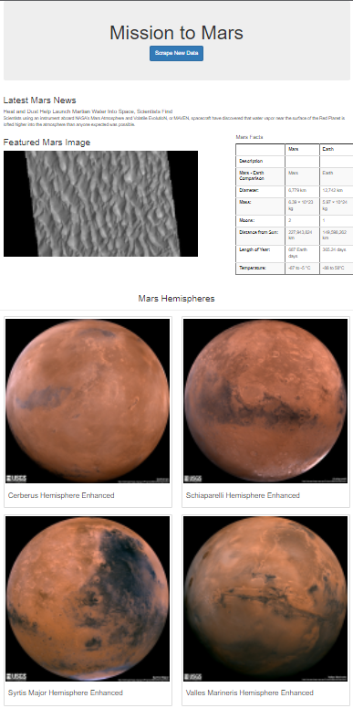
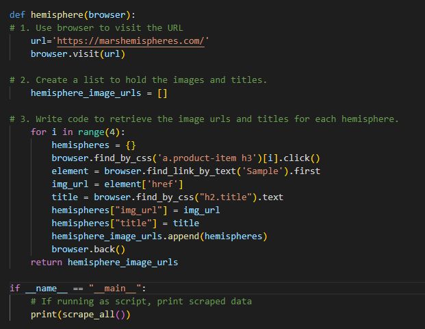
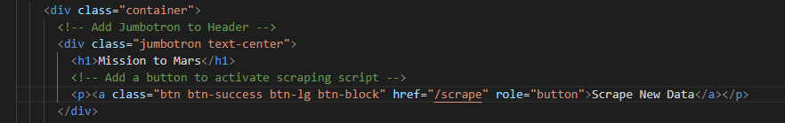
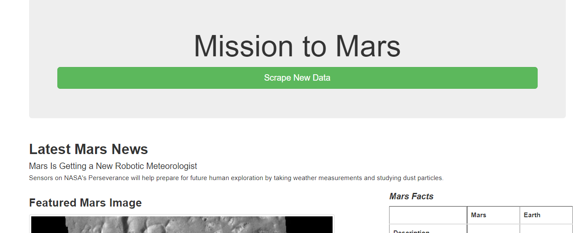
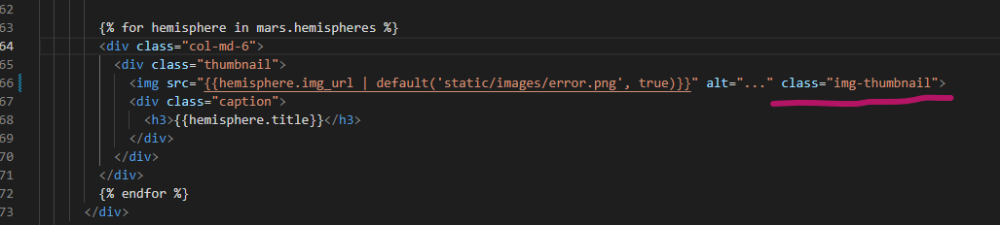
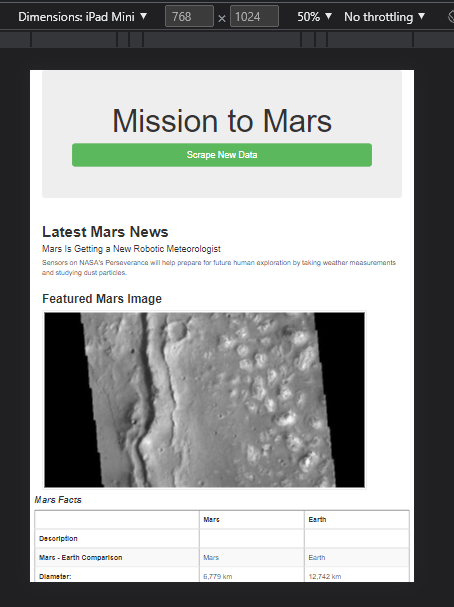

# Mars_Scraping

## Mission-to-Mars Overview:
Utilization of web scrapping from https://data-class-mars.s3.amazonaws.com/Mars/index.html to obtain 
images and information for the updated web page. Ensured viewing on mobile devices as well as desktop to
ensure best viewing for all visitors. 

#### Full page view
### Deliverable 1:
Scraping of High-Resolution Mars Hemisphere Images and Titles

## Mission-to-Mars Coding:

### Deliverable 2 code:
This code reflects the updates for the Web App to pull the new Mars Hemisphere Images and Titles.

### Deliverable 3 Modifications:

#### Code modification for button

#### Style modification

#### Image modification

#### Successful Mobile View

